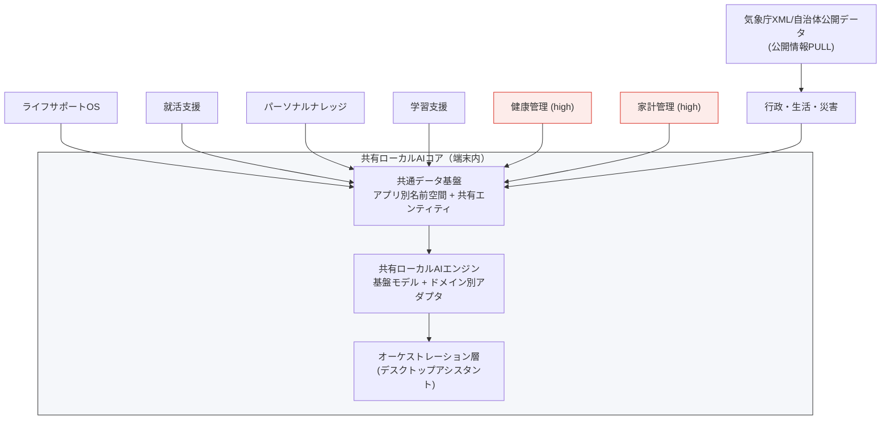
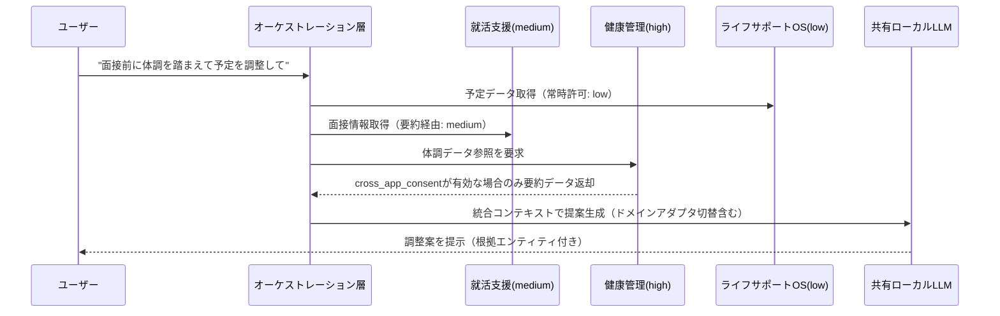
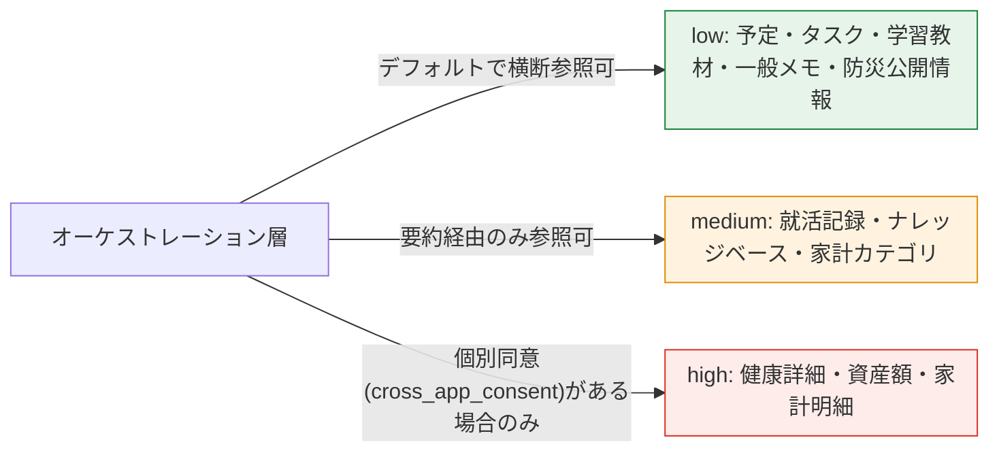
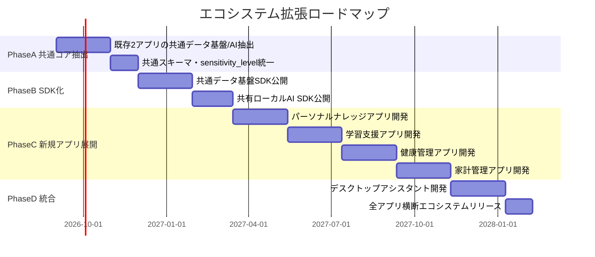

# プライバシーファースト・ローカルAIエコシステム 設計書
### -- 複数アプリが同じローカルAIとデータ基盤を共有し、生活のすべてを端末内だけで理解する --

**バージョン**: v1.0
**位置づけ**: 本書は「ライフサポートOS設計書」の上位に位置する、複数アプリ共通のエコシステム設計書。個々のアプリ内部の詳細設計（画面・DB・AI推論の実装レベル）は各アプリ固有の設計書（ライフサポートOS設計書 等）に委ねる。

---

## 目次

1. Vision・全体像
2. ブランドコンセプト（エコシステム版）
3. アプリポートフォリオとデータ主権境界
4. エコシステムアーキテクチャ
5. 共通データ基盤設計（クロスアプリ）
6. 共有ローカルAI設計
7. アプリ間連携・権限モデル
8. セキュリティ・プライバシー設計（エコシステムガバナンス）
9. ロードマップ

---

## 1. Vision・全体像

### 1.1 Vision

就活支援アプリ、ライフサポートOSという個別アプリを、単なる「複数の便利アプリ」で終わらせず、**同じローカルAIモデルと共通データ基盤を共有する一つのエコシステム**へと発展させる。ユーザーの生活・キャリア・健康・知識・お金・防災といったあらゆる側面を、一つの端末内AIが横断的に理解し、支援する。

外部に個人データを一切送らずにこれを実現することで、「クラウドAIに依存しない生活基盤」という他に類のないポジションを確立する。

### 1.2 想定アプリ群

| # | アプリ | 概要 |
|---|--------|------|
| 1 | ライフサポートOS | 予定・タスク・生活管理（既存・設計済み） |
| 2 | 就活支援 | ES・面接・企業研究（既存） |
| 3 | パーソナルナレッジ | 知識・資料検索 |
| 4 | 学習支援 | 教材・復習・問題生成 |
| 5 | 健康管理 | 睡眠・運動・体調 |
| 6 | 家計管理 | 支出・予算・資産 |
| 7 | 行政・生活・災害サービス | 行政手続き・防災・生活情報（ライフサポートOSのPhase4機能と接続） |
| 8 | ローカルAIデスクトップアシスタント | 上記全アプリを横断するオーケストレーション層 |

### 1.3 なぜ「エコシステム化」が価値を生むか

単体アプリでは「予定管理アプリ」「就活アプリ」の域を出ないが、共通のAIとデータ基盤の上に載ることで、アプリ単体では出せない横断的な提案が可能になる。

- 「来週の最終面接に向けて、直近の睡眠不足を踏まえてスケジュールを軽くしましょう」（就活支援 × 健康管理）
- 「今月の家計が厳しいので、有料の資格講座は来月に延期しては」（家計管理 × 学習支援）
- 「大雨警報が出ています。明日の面接は在宅面接に切り替え可能か確認しましょう」（防災 × 就活支援）

これは各アプリが同じデータ基盤・同じAIを共有していて初めて成立する提案であり、クラウド型の「アプリごとに独立したAI」では実現しにくい体験になる。

---

## 2. ブランドコンセプト（エコシステム版）

### 2.1 コアメッセージ

> **「あなたの人生を理解するAI。データは端末から出ない。」**（既存ブランド）
> → エコシステム版では以下を追記する
> **「キャリアも、健康も、お金も、暮らしも。すべてを理解するのは、あなたの端末の中のAIだけ。」**

### 2.2 差別化の軸（エコシステムレベル）

| 観点 | 一般的なマルチアプリ事業者 | 本エコシステム |
|------|------------------------------|------------------|
| アプリ間データ連携 | 事業者のクラウドサーバーで統合 | 端末内の共通データ基盤で統合 |
| AIモデル | アプリごとに個別のクラウドAPI呼び出し | 全アプリが同一のローカルAIコアを共有 |
| 新アプリ追加時の設計 | 新しいクラウド基盤を都度構築 | 既存の共通データ基盤・AIコアに接続するだけ |
| ユーザーの離脱コスト | クラウド事業者ロックイン | データは常に端末内、いつでもエクスポート可能 |

### 2.3 ブランドの一貫性を保つための原則

既存のライフサポートOS設計書で定義した「公開情報のPULL取得／本人同意済み照会／ローカルAI推論」の三分類は、エコシステム全体でも共通ルールとして踏襲する。加えて、**アプリ間データ共有についても「同意済みスコープのみ」の原則を明文化する**（7章で詳細）。

---

## 3. アプリポートフォリオとデータ主権境界

各アプリが扱うデータの機微度（`sensitivity_level`）と、外部通信の有無を最初に整理する。この表がエコシステム全体の設計判断の基礎になる。

| アプリ | 主なデータドメイン | sensitivity目安 | 外部通信 |
|--------|---------------------|-------------------|----------|
| ライフサポートOS | 予定・タスク・生活全般 | low〜medium | 気象庁XML等（公開データPULL） |
| 就活支援 | ES・面接記録・企業研究メモ | medium | 企業公開情報検索（任意・公開データのみ） |
| パーソナルナレッジ | 保存文書・メモ・資料の全文検索 | low〜medium | なし（完全ローカル） |
| 学習支援 | 教材・復習履歴・問題生成ログ | low | なし（教材著作権への配慮は別途必要） |
| 健康管理 | 睡眠・運動・体調・服薬 | **high** | なし |
| 家計管理 | 支出・予算・資産 | **high** | なし（将来的な銀行連携は別途要件化） |
| 行政・生活・災害サービス | 防災・自治体公開情報 | low（データ自体は個人情報を含まない） | 気象庁XML、将来マイナポータルAPI |
| デスクトップアシスタント | 上記全アプリのオーケストレーション | 参照先のsensitivityを継承 | 各アプリの通信ポリシーを継承（新規通信は発生させない） |

**設計上のポイント**：健康管理・家計管理は`high`固定とし、他アプリからの参照はデフォルトで遮断する（7章で権限モデルとして具体化）。「便利だから」という理由で機微データの参照範囲を安易に広げないことを設計原則として明記する。

---

## 4. エコシステムアーキテクチャ

### 4.1 全体構成



### 4.2 レイヤーの役割

| レイヤー | 役割 |
|----------|------|
| 各アプリ | 固有UI・固有ロジックを持ちつつ、データの永続化とAI推論はコアに委譲する |
| 共通データ基盤 | 全アプリのデータを一元管理。アプリごとに名前空間を分けつつ、共有エンティティ（ユーザー・予定・sensitivity_level等）で横断可能にする |
| 共有ローカルAIエンジン | 基盤モデル（1つ）＋ドメインごとの軽量アダプタ（就活・健康・学習等の語彙やタスクに最適化）という構成にし、モデルを何個も端末に持たない |
| オーケストレーション層 | 複数アプリのデータ・提案を統合し、デスクトップアシスタントとしてユーザーに単一窓口を提供する |

### 4.3 既存2アプリからの移行に関する考え方

現状、ライフサポートOSと就活支援は個別に設計・実装が進んでいる想定のため、エコシステム化は「作り直し」ではなく「共通部分の抽出」として進める（9章のロードマップで詳述）。

- 両アプリの現行データ基盤スキーマを比較し、共通化できるエンティティ（User, Schedule, sensitivity_levelの概念等）を洗い出す
- 両アプリが個別に持っているAI推論ロジック（RAGパイプライン）を、共有コアのAPIとして抽象化する

---

## 5. 共通データ基盤設計（クロスアプリ）

### 5.1 名前空間設計

全アプリが1つのSQLiteファイルを共有する場合でも、テーブルはアプリ単位で名前空間を分け、衝突と誤参照を防ぐ。

```
schema: core        -- 共有エンティティ（User, sensitivity_level定義, embedding_index 等）
schema: lifeos       -- ライフサポートOS固有（schedule, health_record, public_info_cache 等）
schema: jobhunt      -- 就活支援固有（es_draft, interview_log, company_research）
schema: knowledge    -- パーソナルナレッジ固有（document, note, source_ref）
schema: learning     -- 学習支援固有（material, review_log, generated_question）
schema: health       -- 健康管理固有（sleep_log, exercise_log, vitals）※ sensitivity_level=high固定
schema: finance      -- 家計管理固有（transaction, budget, asset）※ sensitivity_level=high固定
schema: gov_disaster  -- 行政/防災固有（public_info_cache は core 経由でlifeosと共有）
```

`core`スキーマに置く共有エンティティは、4.6（ライフサポートOS設計書）で定義したものをベースに、アプリ横断で使えるよう`app_origin`カラムを追加する。

```sql
-- 共有エンティティの拡張例（コアスキーマ）
ALTER TABLE ai_insight ADD COLUMN app_origin TEXT NOT NULL DEFAULT 'lifeos';
-- 例: 'lifeos' | 'jobhunt' | 'knowledge' | 'learning' | 'health' | 'finance' | 'gov_disaster'

CREATE TABLE cross_app_consent (
    consent_id     TEXT PRIMARY KEY,
    requesting_app TEXT NOT NULL,   -- 参照したいアプリ
    target_app     TEXT NOT NULL,   -- 参照されるアプリ
    scope          TEXT NOT NULL,   -- 例: 'summary_only', 'full_access'
    granted_at     DATETIME,
    revoked_at     DATETIME
);
```

`cross_app_consent`テーブルにより、「就活支援アプリが健康管理データを参照してよいか」をユーザーが個別に許可・撤回できる状態を、データ基盤レベルで保証する。

### 5.2 埋め込みインデックスの扱い

`embedding_index`は`core`スキーマに一本化し、`entity_type`に`app_origin`を含めることで、オーケストレーション層が「どのアプリ由来のデータか」を意識しながら横断検索できるようにする。

---

## 6. 共有ローカルAI設計

### 6.1 基盤モデル＋ドメインアダプタ方式

アプリごとに専用LLMを持つのは端末リソース上非現実的なため、以下の構成を取る。

- **基盤モデル**：1つの汎用ローカルLLM（ライフサポートOS設計書5章のモデル選定方針を継承）
- **ドメインアダプタ**：LoRA等の軽量アダプタ形式で、就活支援（ES添削・面接想定問答）、学習支援（問題生成）、健康管理（体調変化の解釈）など、ドメイン固有の語彙・タスクに最適化した差分のみを追加ロードする

これにより、モデル本体は1つのまま、アプリごとの専門性を確保できる。

### 6.2 オーケストレーション層の推論フロー



`HEALTH`から`ORCH`への矢印にあるとおり、**同意（`cross_app_consent`）が無ければ健康データはオーケストレーション層にすら渡らない**ことを設計上のデフォルトとする（7章で権限モデルとして具体化）。

---

## 7. アプリ間連携・権限モデル

### 7.1 sensitivity_levelに基づくデフォルト境界



### 7.2 権限モデルの運用ルール

- **low**：アプリ間で常時参照可能（予定・タスク・学習教材・防災公開情報など、機微性が低いデータ）
- **medium**：生値ではなく要約・抽象化した形でのみ他アプリ／オーケストレーション層に渡す（就活記録の詳細本文は渡さず「面接予定あり」程度の要約に留める等）
- **high**：`cross_app_consent`テーブルで明示的に許可されたスコープのみ、かつ都度ユーザーに参照が発生したことを通知する（8章の透明性要件と連動）

### 7.3 同意UI設計の考え方

- 新規アプリインストール時、あるいは初めて他アプリのhighデータを参照しようとするタイミングで、個別の同意ダイアログを表示する
- 同意は「今回のみ」「常時許可」「拒否」の3択とし、後から設定画面でいつでも撤回できるようにする（既存ライフサポートOS設計書9章のプラグイン権限モデルと統一的なUI体験にする）

---

## 8. セキュリティ・プライバシー設計（エコシステムガバナンス）

### 8.1 基本方針

ライフサポートOS設計書9章で定義した脅威モデル・監査方針は、エコシステム全体にもそのまま適用する。加えて、アプリ間連携特有のリスクに対応する。

| 脅威 | 対策 |
|------|------|
| あるアプリの脆弱性が他アプリの機微データ漏洩につながる | `cross_app_consent`による明示的な境界＋sensitivity_levelごとのアクセス制御をコア側で一元的に強制する（各アプリの実装に委ねない） |
| 新規アプリ追加時にデフォルトで広い権限を持ってしまう | 新規アプリは`low`相当の権限からスタートし、`medium`/`high`は個別同意が必須という設計をSDKレベルで強制する |
| オーケストレーション層がすべてのデータへの実質的なマスターキーになる | オーケストレーション層自体の推論ログ・参照ログを詳細に記録し、ユーザーがいつでも「アシスタントが何を見たか」を確認できるようにする |

### 8.2 透明性UIの拡張

ライフサポートOS設計書8章の「外部通信ログ」画面を、エコシステム版では「アプリ間参照ログ」としても拡張する。「就活支援がいつ健康管理データを参照したか」が一覧で確認できることが、複数アプリ展開時の信頼の核になる。

---

## 9. ロードマップ

### 9.1 拡張フェーズ



### 9.2 フェーズごとの狙い

| フェーズ | 狙い |
|----------|------|
| PhaseA | 「作り直し」ではなく、既存2アプリの中から共通部分を見極めて抽出する。ここで7章の権限モデルの土台（sensitivity_level, cross_app_consent）も先に整備する |
| PhaseB | 共通データ基盤・共有AIをSDK化し、以降のアプリ開発を「コアに接続するだけ」にする。ここが完了すれば新規アプリの開発コストが大きく下がる |
| PhaseC | 新規4アプリを順次展開。health/financeは`high`固定のため、権限モデルの検証を重点的に行う |
| PhaseD | デスクトップアシスタントで全アプリを横断統合し、エコシステムとして完成させる |

### 9.3 既存設計書との関係整理

- 本書：エコシステム全体のアーキテクチャ・権限モデル・ロードマップ
- ライフサポートOS設計書：本エコシステムにおける「ライフサポートOS」アプリの詳細実装設計（データモデル、UI、防災連携の実装詳細等）
- 今後、就活支援・健康管理・家計管理等についても同様の粒度の個別設計書を作成し、本書の7章（権限モデル）・5章（共通データ基盤）との整合性を都度チェックする運用とする

---

*本書はエコシステムv1.0として、全体構成・権限モデル・ロードマップを整理したものです。次は、この設計を既存の就活支援アプリの現行実装と突き合わせ、PhaseAの「共通抽出」対象範囲を具体化するのが良い進め方だと考えます。*
