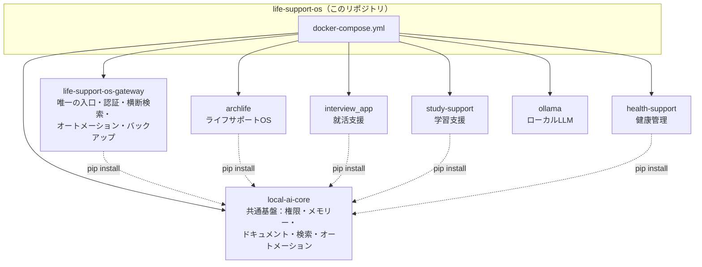

# life-support-os

「セキュリティ・プライバシーファーストなローカルAIエコシステム」の umbrella repo。
複数の独立したアプリ(モジュール)を、共通基盤(`local-ai-core`)と1つの入口
(`life-support-os-gateway`)でまとめて動かすための、Docker Compose定義と
各モジュールのsubmodule参照だけを持つ、非常に薄いリポジトリ。

すべてのデータは端末内の SQLite にのみ保存され、外部(クラウド)には一切送信されない。
これはこのプロジェクト全体の一貫した設計方針であり、機能を追加するたびに
確認してきた原則でもある。

---

## 全体構成



各モジュールはそれぞれ独立したGitHubリポジトリで管理されており、このリポジトリは
それらをsubmoduleとして参照しているだけ。モジュール個別の実装・機能詳細は、
それぞれのリポジトリのREADMEを参照。

| モジュール | 役割 | ポート | リポジトリ |
|---|---|---|---|
| `life-support-os-gateway` | 唯一の入口。認証・統合コンソール・横断検索・オートメーション・バックアップ | 3000 | [life-support-os-gateway](https://github.com/Myubd/life-support-os-gateway) |
| `local-ai-core` | 共通基盤。権限管理・メモリー・ドキュメントセンター・検索・オートメーション・アシスタント | (ライブラリ) | [local-ai-core](https://github.com/Myubd/local-ai-core) |
| `archlife` | ライフサポートOS(予定・タスク・生活管理) | 8080 / 8081 | [archlife](https://github.com/Myubd/archlife) |
| `interview_app` | 就活支援(ES・面接・企業研究) | 8000 / 3001 | [interview-ai-app](https://github.com/Myubd/interview-ai-app) |
| `study-support` | 学習支援(学習ログ・苦手分野推測) | 8100 | [study-support](https://github.com/Myubd/study-support) |
| `health-support` | 健康管理(体調ログ・不調傾向推測) | 8200 | [health-support](https://github.com/Myubd/health-support) |

---

## 設計思想

- **クラウドに個人情報を送らない**: すべてのデータは端末内のSQLite(`core.db`)に
  保存される。gatewayを含むどのモジュールも、ユーザーが明示的にオプトインしない限り
  外部APIを呼ばない。
- **「AIが全部知っている」を避ける**: 各アプリは、使いたいデータへのアクセスを
  `plugin_manifest.json`で申告するだけで、実際にアクセスできるのはユーザーが
  gatewayの権限台帳で個別に許可した範囲だけ。
- **新しい設計パターンを増やさない**: `study-support`で確立したパターン
  (memory書き込み・schedule書き込み・権限が無くても本体機能は落とさない設計)を、
  `health-support`にもそのまま適用できることを実証済み。新しいアプリを足すたびに
  仕組みを作り直さない。
- **単一ユーザー前提**: プライバシー・セキュリティを最優先するため、複数プロフィール
  (家族共有等)は設計上の対象外としている。

---

## クイックスタート

### 方法A: Windowsインストーラーで使う(推奨・簡単)

Docker不要。[Releases](https://github.com/Myubd/life-support-os/releases/latest)から
`LifeSupportOS-Setup-x.x.x.exe`をダウンロードして実行するだけです。
Program Files配下にインストールされ、データは`%APPDATA%\LifeSupportOS`に保存されます。

### 方法B: Docker Composeで使う(開発・Windows以外)

### 1. clone(submoduleを含めて)

```bash
git clone --recurse-submodules https://github.com/Myubd/life-support-os.git
cd life-support-os
```

すでに`--recurse-submodules`無しでcloneしてしまった場合:

```bash
git submodule update --init --recursive
```

### 2. `.env`を作る(gatewayの認証トークンが必須)

```bash
echo "GATEWAY_AUTH_TOKEN=$(openssl rand -hex 32)" > .env
```

(Windows/PowerShellの場合)

```powershell
"GATEWAY_AUTH_TOKEN=$(-join ((48..57)+(97..122)|Get-Random -Count 40|%{[char]$_}))" | Out-File -Encoding utf8 .env
```

`.env`は`.gitignore`で除外されているため、コミットされることはない。

### 3. モデルを取得(初回のみ)

```bash
docker compose --profile setup run --rm model_setup
```

### 4. 起動

```bash
docker compose up -d
```

起動後、`http://localhost:3000/` を開き、`.env`に設定した`GATEWAY_AUTH_TOKEN`の値で
ログインする。

---

## 動作要件

| 項目 | 内容 |
|------|------|
| OS | Windows(WSL2) / macOS / Linux |
| Docker | Docker Desktop(WSL2バックエンド推奨) |
| GPU | 必須ではないが、`ollama`サービスはNVIDIA GPU(WSL2 CUDA対応ドライバ)を使う設定になっている。無い場合は`docker-compose.yml`の`deploy.resources`セクションを調整する |
| ディスク | 各モジュールのDB・Ollamaのモデル(数GB)・`core.db`のバックアップ分の空き容量 |

---

## バックアップ

`core.db`(全モジュール共通のデータ基盤)は、gatewayが24時間ごとに自動バックアップし、
このリポジトリのルート直下`backups/`(**Git管理対象外**)に保存する。手動で今すぐ
取りたい場合は、ログイン済みの状態で`POST /admin/backup`を呼び出す。

復元手順や設定項目の詳細は[life-support-os-gatewayのREADME](https://github.com/Myubd/life-support-os-gateway)を参照。

---

## セキュリティ上の注意

- `core.db` `device_identity.json`のような実データ・鍵情報は、このリポジトリ・
  各submoduleリポジトリのいずれにも含めないこと(`.gitignore`で除外済み)。
  privateリポジトリであっても、クラウド(GitHub)に個人データを送らないという
  設計方針そのものに反するため。
- `GATEWAY_AUTH_TOKEN`は必ず既定値から変更すること。gatewayはこのトークンが
  設定されていないと起動を拒否する(fail-closed)。

---

## 制約(現時点)

- ナレッジグラフ(項目間の関連性の可視化)は未実装
- WebSocket/SSE(ストリーミング応答等)は未対応
- 複数プロフィール(家族利用)は設計上の対象外
